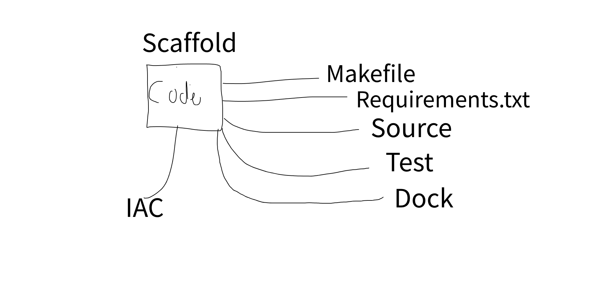

# Devop-training
Tutorial by https://www.youtube.com/watch?v=SqFFCTNyi88&amp;t=4619s

## Scaffold

1. Create a Python Virtual Environment `python3 -m venv ~/.venv` or `virtualenv ~/.venv`
2. Create empty files: `Makefile`, `requirements.txt`, `main.py`, `Dockerfile`, `mylib\__init__.py`
3. Populate `Makefile`
